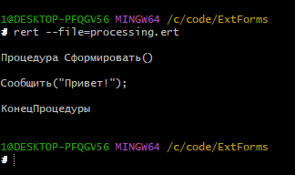

# Reading ERT files 1C 7.7

rert (Reading ERT) – Консольная утилита, предназначенная для просмотра исходного кода внешних обработок (.ert файлов) для платформы 1С 7.7

## Скриншот




## 📦 Сборка

### Установка компилятора

#### Windows

`C:\Windows\System32`

1. Необходимо скачать [MSYS2 MINGW64](https://www.msys2.org/)
2. Запустить `MSYS2 MINGW64` и выполнить следующие команды:

```bash
pacman -Syu
```

```bash
pacman -S mingw-w64-x86_64-gcc mingw-w64-x86_64-make mingw-w64-x86_64-zlib make
```

Эта команда установит последнюю версию компилятора `GCC`

#### Linux / MacOS

В этих операционных системах как правило уже предустановлен компилятор `GCC`


### Сборка проекта

1. Переходим в папку с проектом в вашем терминале
2. Запускаем сборку

```bash
make
```

После успешного компилирования в директории проекта будет создана папка `build` с исполняемым файлом `rert`.

Чтобы иметь возможность запускать программу из любой папки, разместите её в директории, указанной в PATH.
